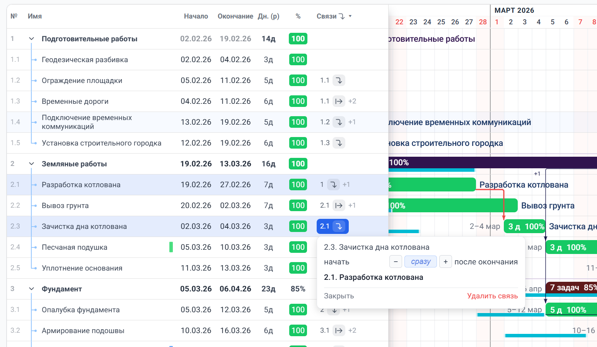
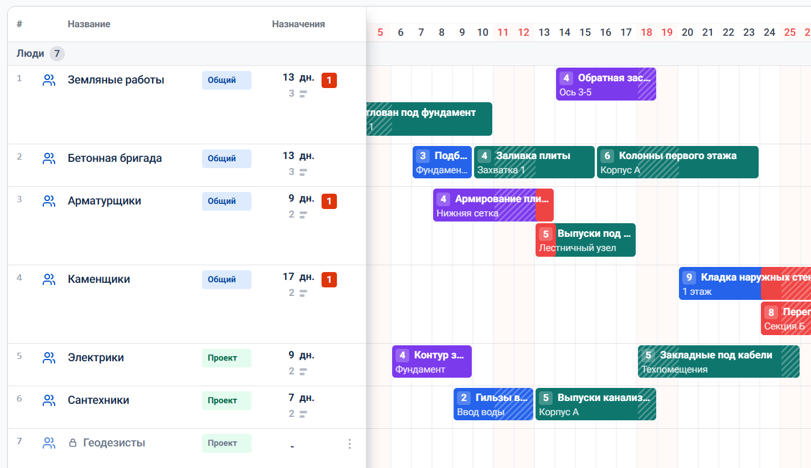
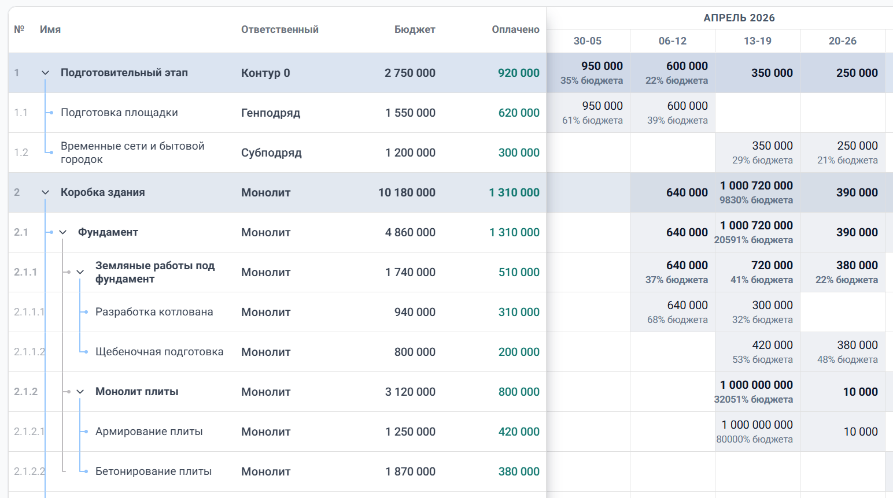

# gantt-lib

[](https://gantt-lib-demo.vercel.app/)
[](https://www.npmjs.com/package/gantt-lib)
[](https://www.npmjs.com/package/gantt-lib)
[](https://www.npmjs.com/package/gantt-lib)


`gantt-lib` — React/Next.js библиотека для интерфейсов планирования. Она подходит не только для классического gantt chart, но и для ресурсных экранов, календарей загрузки и табличных матриц по периодам, например для финансов, бюджетов и план-факта.

### Проектный график

Классический gantt-интерфейс для планирования этапов, задач, сроков и зависимостей.



### Ресурсный план

Отдельный режим для людей, оборудования, материалов и других ресурсов с календарём загрузки и переназначениями.



### Финансовая матрица

Табличный режим по периодам для бюджетов, план-факта, KPI и других data-matrix сценариев.



Подходит для product planning, project delivery, resource allocation, capacity planning и finance-driven интерфейсов, где важны сроки, связи, загрузка и данные по периодам.

Реальный пример использования: [ai.getgantt.ru](https://ai.getgantt.ru/)

## Установка

### NPM (рекомендуется)

```bash
npm install gantt-lib
```

### Разработка/Contributing

```bash
git clone https://github.com/simon100500/gantt-lib.git
cd gantt-lib
npm i
npm run dev
```

После запуска откройте [http://localhost:3000](http://localhost:3000) в браузере.

## Возможности

- Классическая диаграмма Ганта с задачами, этапами и вложенностью
- Drag-and-drop редактирование сроков прямо на таймлайне
- Связи между задачами и автоматический пересчёт зависимого расписания
- Работа в календарных или рабочих днях с учётом выходных и кастомного календаря
- Левый Task List с настраиваемыми и скрываемыми колонками
- Поиск, фильтрация и подсветка нужных задач
- Режим resource planner для людей, оборудования, материалов, помещений и других ресурсов
- Перенос и переназначение resource-assignments между датами и ресурсами
- Группировка ресурсов, inline-редактирование и отображение конфликтов загрузки
- Режим table matrix для финансовых планов, бюджетов, KPI, план-факта и других period-based таблиц
- Общая временная шкала и синхронная высота строк между таблицей и правой частью
- Настройка внешнего вида через CSS-переменные и TypeScript-first API

## Быстрый старт

```tsx
import { GanttChart, type Task } from 'gantt-lib';
import 'gantt-lib/styles.css';
import { useState } from 'react';

const initialTasks: Task[] = [
  {
    id: '1',
    name: 'Планирование спринта',
    startDate: '2026-02-01',
    endDate: '2026-02-07',
    color: '#3b82f6',
  },
  {
    id: '2',
    name: 'Разработка',
    startDate: '2026-02-08',
    endDate: '2026-02-20',
  },
];

export default function App() {
  const [tasks, setTasks] = useState(initialTasks);

  return (
    <GanttChart
      tasks={tasks}
      showTaskList
      dayWidth={40}
      rowHeight={40}
      onTasksChange={(changed) =>
        setTasks((prev) => {
          const byId = new Map(prev.map((task) => [task.id, task]));
          for (const task of changed) {
            byId.set(task.id, task);
          }
          return [...byId.values()];
        })
      }
    />
  );
}
```

## Часто используемые пропсы GanttChart

| Проп           | Тип                                                     | По умолчанию    | Описание                                      |
| -------------- | ------------------------------------------------------- | --------------- | --------------------------------------------- |
| `tasks`        | `Task[]`                                                | обязательный    | Массив задач для отображения                  |
| `viewMode`     | `'day' \| 'week' \| 'month'`                            | `'day'`         | Масштаб временной шкалы                       |
| `dayWidth`     | `number`                                                | `40`            | Ширина столбца в пикселях                     |
| `rowHeight`    | `number`                                                | `40`            | Высота строки в пикселях                      |
| `headerHeight` | `number`                                                | `40`            | Высота заголовка в пикселях                   |
| `containerHeight` | `number \| string`                                  | `undefined`     | Высота контейнера: px, `%`, `vh` или auto     |
| `showTaskList` | `boolean`                                               | `false`         | Показывает левую панель TaskList              |
| `showChart`    | `boolean`                                               | `true`          | Позволяет скрыть правую часть с таймлайном    |
| `showBaseline` | `boolean`                                               | `false`         | Показывает baseline для задач с baseline-датами |
| `taskListWidth`| `number`                                                | `660`           | Желаемая ширина TaskList в пикселях           |
| `taskListColumnWidths` | `TaskListColumnWidthMap`                         | —               | Controlled/initial ширины встроенных и кастомных колонок TaskList |
| `businessDays` | `boolean`                                               | `true`          | Считать длительность в рабочих днях           |
| `disableTaskDrag` | `boolean`                                            | `false`         | Отключает drag-and-drop и resize задач        |
| `enableTaskMultiSelect` | `boolean`                                      | `false`         | Добавляет первый столбец с чекбоксами выбора строк |
| `selectedTaskIds` | `Set<string>`                                       | —               | Controlled-набор выбранных задач              |
| `onSelectedTaskIdsChange` | `(taskIds: Set<string>) => void`             | —               | Вызывается при изменении мультивыбора         |
| `onTasksChange`| `(tasks: Task[]) => void`                               | —               | Вызывается с массивом изменённых задач        |
| `onCascade`    | `(tasks: Task[]) => void`                               | —               | Возвращает все сдвинутые задачи при auto-schedule |

Полный список актуальных пропсов смотрите в `docs/reference/04-props.md`.

## Кастомные колонки TaskList

TaskList теперь расширяется через `additionalColumns` и единый API колонок:

- `renderCell` для отображения
- `renderEditor` для редактирования
- `before` / `after` для позиционирования
- `width` только числом в пикселях
- `hiddenTaskListColumns` для скрытия встроенных и кастомных колонок по `id`
- `taskListColumnWidths` и `onTaskListColumnWidthsChange` для управления ширинами колонок, включая drag-resize из header

Короткий пример:

```tsx
import { GanttChart, type Task, type TaskListColumn } from 'gantt-lib';

type MyTask = Task & { assignee?: string };

const additionalColumns: TaskListColumn<MyTask>[] = [
  {
    id: 'assignee',
    header: 'Assignee',
    after: 'name',
    width: 120,
    renderCell: ({ task }) => task.assignee ?? '—',
    renderEditor: ({ task, updateTask, closeEditor }) => (
      <input
        autoFocus
        defaultValue={task.assignee ?? ''}
        onBlur={(e) => {
          updateTask({ assignee: e.target.value || undefined });
          closeEditor();
        }}
      />
    ),
  },
];

<GanttChart
  tasks={tasks}
  showTaskList
  additionalColumns={additionalColumns}
  hiddenTaskListColumns={['duration', 'assignee']}
/>
```

Старое поле `editor` больше не поддерживается. Полное руководство: `docs/reference/13-tasklist-columns.md`.

## Интерфейс Task

```typescript
interface Task {
  id: string;               // Уникальный идентификатор
  name: string;             // Название, отображаемое на полосе
  startDate: string | Date; // ISO-строка или Date (UTC)
  endDate: string | Date;   // ISO-строка или Date (UTC)
  baselineStartDate?: string | Date;
  baselineEndDate?: string | Date;
  type?: 'task' | 'milestone';
  color?: string;           // Необязательный цвет, например '#3b82f6'
  progress?: number;        // Прогресс 0–100. Отображает полосу прогресса внутри задачи.
  accepted?: boolean;       // Только при progress === 100. true = зелёная полоса, false/undefined = жёлтая.
  dependencies?: TaskDependency[];
  locked?: boolean;
  divider?: 'top' | 'bottom';
  parentId?: string;
}
```

Даты могут быть ISO-строками (`'2026-02-01'`) или объектами `Date`. Все вычисления дат выполняются в UTC.

## Взаимодействие при перетаскивании

| Действие               | Как выполнить                         |
| ---------------------- | ------------------------------------- |
| Переместить задачу     | Перетащить за центр полосы            |
| Изменить размер слева  | Перетащить левый край (зона 12px)     |
| Изменить размер справа | Перетащить правый край (зона 12px)    |

Задачи привязываются к границам дней. Во время перетаскивания отображается тултип с датами.

## Кастомизация

Переопределите CSS-переменные в вашем глобальном стилевом файле:

```css
:root {
  /* Сетка */
  --gantt-grid-line-color: #e0e0e0;
  --gantt-cell-background: #ffffff;
  --gantt-row-hover-background: #f8f9fa;

  /* Размеры */
  --gantt-row-height: 40px;
  --gantt-header-height: 40px;
  --gantt-day-width: 40px;

  /* Полосы задач */
  --gantt-task-bar-default-color: #3b82f6;
  --gantt-task-bar-text-color: #ffffff;
  --gantt-task-bar-border-radius: 4px;
  --gantt-task-bar-height: 28px;

  /* Прогресс-бар */
  --gantt-progress-color: rgba(0, 0, 0, 0.2); /* В процессе */
  --gantt-progress-completed: #fbbf24;         /* 100%, не принято */
  --gantt-progress-accepted: #22c55e;          /* 100%, принято */

  /* Индикатор сегодня */
  --gantt-today-indicator-color: #ef4444;
  --gantt-today-indicator-width: 2px;
}
```

## Разработка

Этот проект использует Turborepo для управления монорепо.

```bash
npm install
npm run dev      # Запустить dev-сервер (website package)
npm run build    # Собрать все пакеты
npm run test     # Запустить unit-тесты (gantt-lib package)
npm run lint     # ESLint для всех пакетов
```

### Структура монорепо

```
packages/
  gantt-lib/    # Библиотека компонентов (npm package)
  website/      # Demo-сайт на Next.js
```

## Стек

- **React** 19 + **Next.js** 15
- **TypeScript** 5 (strict)
- **date-fns** 4 — форматирование дат
- **CSS Modules** — изолированные стили
- **Vitest** + React Testing Library — тесты

## Архитектурные заметки

**Производительность:** `TaskRow` обёрнут в `React.memo` с кастомным компаратором, который исключает внешние callbacks вроде `onTasksChange`. При перетаскивании перерисовывается только перетаскиваемая строка — остальные не трогаются. Обновления позиции используют рефы + `requestAnimationFrame`, чтобы не нагружать React state на каждый кадр.

**Паттерн состояния:** `onTasksChange` отдаёт только изменённые задачи, а consumer сам мержит их в своё состояние. Это позволяет обновлять большие массивы задач без лишней пересборки всего списка внутри библиотеки.

**Даты:** Все внутренние вычисления дат выполняются в UTC, чтобы избежать смещений из-за перехода на летнее время. Для надёжности передавайте даты как ISO-строки (`'2026-02-01'`).
